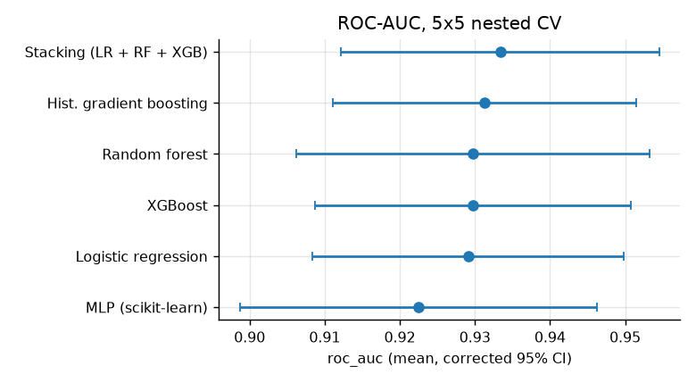
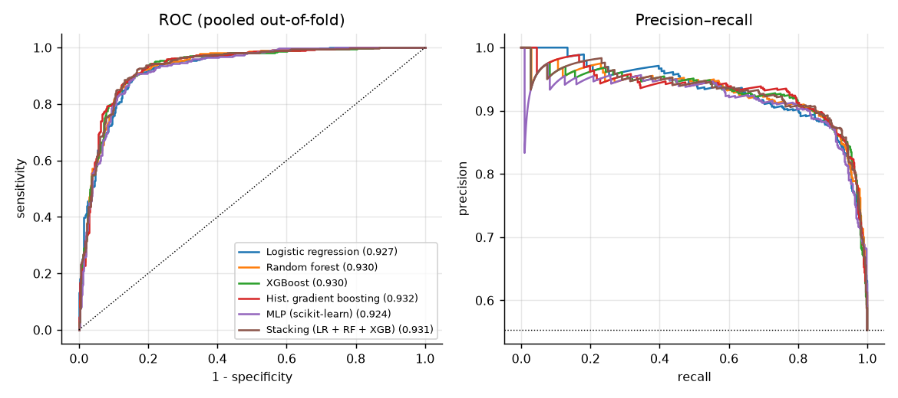
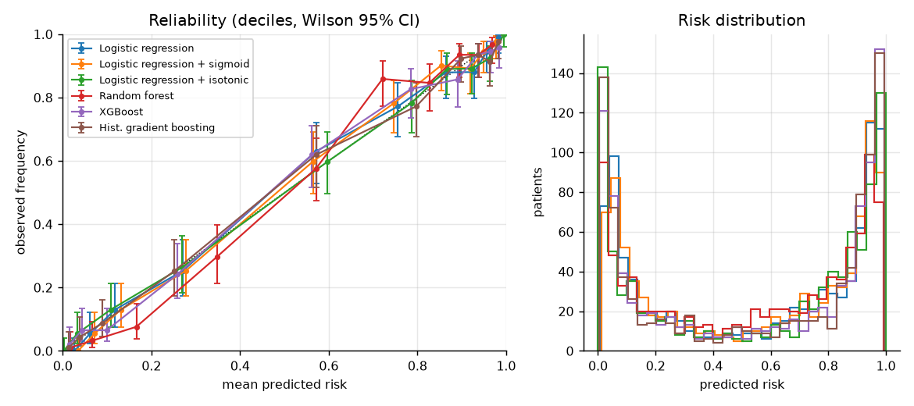
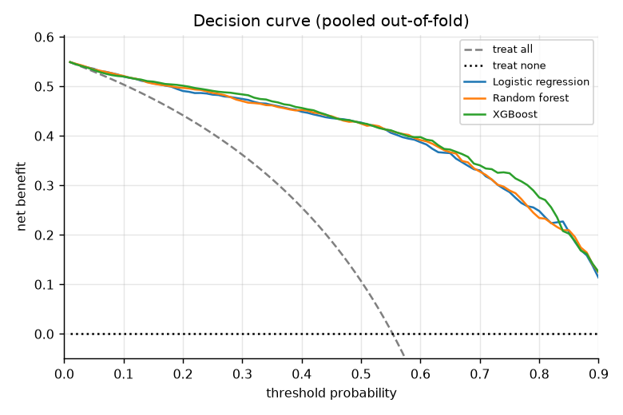
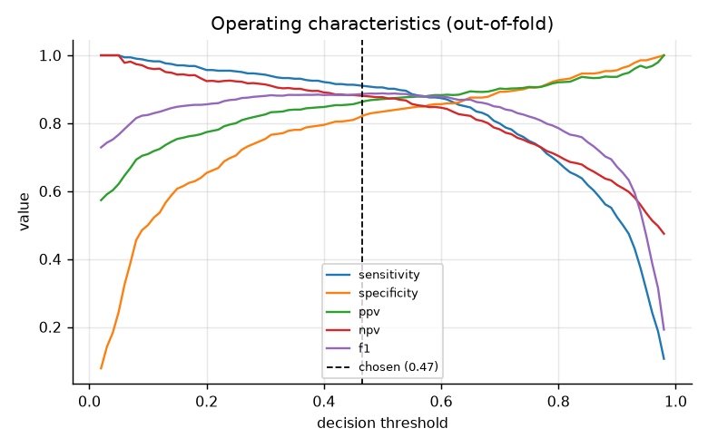
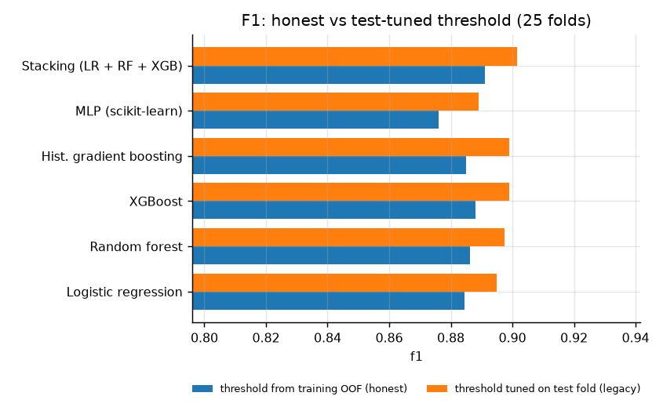
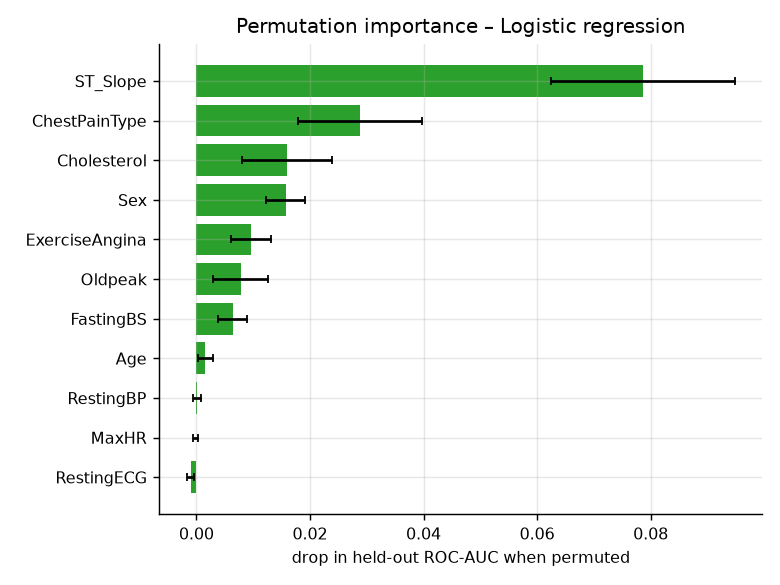
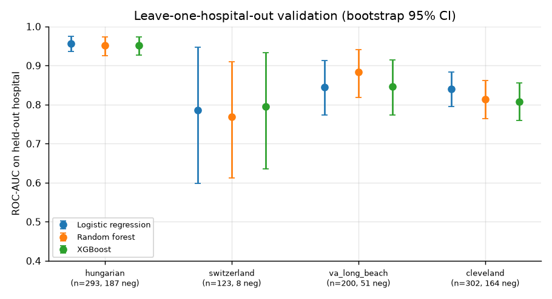
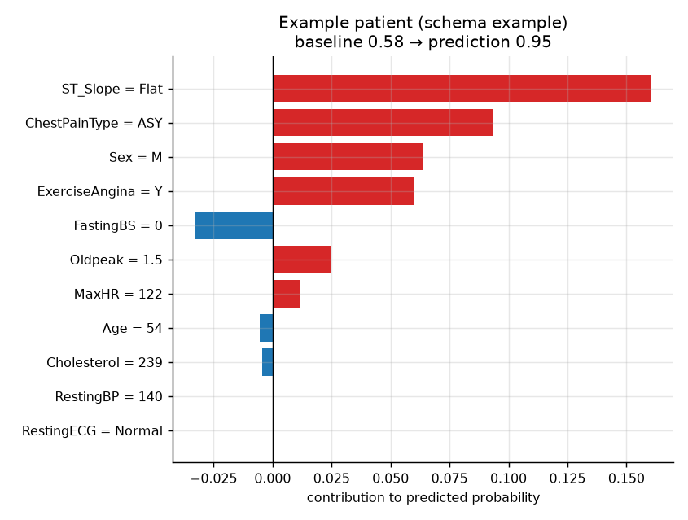

# heartrisk – evaluation report

*Generated by `heartrisk study` (heartrisk 1.0.0, 10.3 min). Do not edit by hand.*

## 1. Data

`data/heart.csv`: 918 patients, prevalence 0.553. Cholesterol is recorded as 0 for
172 patients; their disease rate is 0.88 vs
0.48 for the rest. Those zeros are missing measurements, not values
(the whole Switzerland cohort has no cholesterol). Zeros in `Cholesterol`/`RestingBP` are converted to missing
**inside** the pipeline and imputed with training-fold medians plus a missing-indicator.

| feature | type | missing | values |
|---|---|---|---|
| Age | numeric | 0 | 28 – 77 (median 54) |
| RestingBP | numeric | 1 | 80 – 200 (median 130) |
| Cholesterol | numeric | 172 | 85 – 603 (median 237) |
| MaxHR | numeric | 0 | 60 – 202 (median 138) |
| Oldpeak | numeric | 0 | -2.6 – 6.2 (median 0.6) |
| FastingBS | numeric | 0 | 0 – 1 (median 0) |
| Sex | categorical | 0 | M (725), F (193) |
| ChestPainType | categorical | 0 | ASY (496), NAP (203), ATA (173), TA (46) |
| RestingECG | categorical | 0 | Normal (552), LVH (188), ST (178) |
| ExerciseAngina | categorical | 0 | N (547), Y (371) |
| ST_Slope | categorical | 0 | Flat (460), Up (395), Down (63) |
| HeartDisease | target | 0 | prevalence 0.553 (n=918) |

The file concatenates four hospitals in a fixed order. Site labels are recovered from the published cohort sizes
and verified against the published number of positives per cohort (`heartrisk.data.infer_sites`):

| site | patients | prevalence | cholesterol_missing |
|---|---|---|---|
| hungarian | 293 | 0.362 | 0.000 |
| switzerland | 123 | 0.935 | 1.000 |
| va_long_beach | 200 | 0.745 | 0.245 |
| cleveland | 302 | 0.457 | 0.000 |

## 2. Protocol

* 5× repeated stratified 5-fold CV; all models share the same splits (paired).
* Inside every outer training part: 5-fold grid search (`neg_log_loss`), then the
  decision threshold (`f1`) is chosen on **inner out-of-fold** predictions, then the model is
  refitted and the untouched test fold is scored.
* Uncertainty: corrected resampled t-test / CI (Nadeau & Bengio 2003) because CV folds overlap; Holm correction
  for multiple comparisons; percentile bootstrap for pooled predictions.

## 3. Results

### 3.1 Model comparison (mean over 25 outer folds, corrected 95% CI)

| model | ROC-AUC | PR-AUC | Brier | ECE | cal. slope | F1 | sens. | spec. | threshold |
|---|---|---|---|---|---|---|---|---|---|
| Logistic regression | 0.929 (0.908–0.950) | 0.936 | 0.102 (0.085–0.119) | 0.061 | 1.07 | 0.885 | 0.912 | 0.814 | 0.45 |
| Random forest | 0.930 (0.906–0.953) | 0.931 | 0.101 (0.085–0.118) | 0.068 | 1.25 | 0.886 | 0.919 | 0.807 | 0.48 |
| XGBoost | 0.930 (0.909–0.951) | 0.931 | 0.098 (0.082–0.113) | 0.057 | 0.97 | 0.888 | 0.926 | 0.801 | 0.39 |
| Hist. gradient boosting | 0.931 (0.911–0.952) | 0.932 | 0.097 (0.082–0.113) | 0.056 | 0.94 | 0.885 | 0.918 | 0.806 | 0.42 |
| MLP (scikit-learn) | 0.922 (0.899–0.946) | 0.924 | 0.110 (0.087–0.132) | 0.072 | 1.22 | 0.876 | 0.910 | 0.793 | 0.48 |
| Stacking (LR + RF + XGB) | 0.933 (0.912–0.955) | 0.936 | 0.096 (0.078–0.113) | 0.057 | 1.09 | 0.891 | 0.921 | 0.819 | 0.44 |

Paired comparison against **Logistic regression** (corrected t-test, Holm-adjusted):

| model | ΔAUC | ΔAUC lo | ΔAUC hi | p (AUC) | p Holm (AUC) | ΔBrier | p Holm (Brier) |
|---|---|---|---|---|---|---|---|
| Random forest | 0.0007 | -0.0085 | 0.0098 | 0.8844 | 1.0000 | -0.0008 | 1.0000 |
| XGBoost | 0.0006 | -0.0063 | 0.0075 | 0.8535 | 1.0000 | -0.0047 | 0.8739 |
| Hist. gradient boosting | 0.0022 | -0.0094 | 0.0137 | 0.7002 | 1.0000 | -0.0050 | 1.0000 |
| MLP (scikit-learn) | -0.0066 | -0.0235 | 0.0103 | 0.4268 | 1.0000 | 0.0073 | 1.0000 |
| Stacking (LR + RF + XGB) | 0.0043 | -0.0025 | 0.0111 | 0.2025 | 1.0000 | -0.0066 | 0.0414 |

Highest mean ROC-AUC: **Stacking (LR + RF + XGB)**. No model is significantly better than Logistic regression after Holm correction, so the simplest model is deployed (Logistic regression: transparent coefficients, good calibration, cheap exact explanations). Stacking (LR + RF + XGB) has a significantly lower Brier score (Δ -0.0066, Holm p = 0.041), a gain that is small next to its cost in complexity and runtime.

Pooled out-of-fold predictions (each patient's probability averaged over repeats; bootstrap 95% CI):

| model | pooled_auc | auc_lo | auc_hi | pr_auc | brier |
|---|---|---|---|---|---|
| Logistic regression | 0.927 | 0.910 | 0.944 | 0.932 | 0.101 |
| Random forest | 0.930 | 0.913 | 0.947 | 0.928 | 0.100 |
| XGBoost | 0.930 | 0.913 | 0.947 | 0.929 | 0.096 |
| Hist. gradient boosting | 0.932 | 0.915 | 0.949 | 0.931 | 0.095 |
| MLP (scikit-learn) | 0.924 | 0.906 | 0.941 | 0.919 | 0.104 |
| Stacking (LR + RF + XGB) | 0.931 | 0.914 | 0.948 | 0.930 | 0.095 |

### 3.2 Calibration and clinical utility

| model | ROC-AUC | PR-AUC | Brier | ECE | cal. slope | F1 | sens. | spec. | threshold |
|---|---|---|---|---|---|---|---|---|---|
| Logistic regression + sigmoid | 0.929 (0.908–0.949) | 0.935 | 0.102 (0.086–0.118) | 0.063 | 1.13 | 0.886 | 0.910 | 0.820 | 0.46 |
| Logistic regression + isotonic | 0.927 (0.907–0.947) | 0.931 | 0.104 (0.086–0.122) | 0.060 | 0.86 | 0.881 | 0.903 | 0.818 | 0.49 |

Neither Platt (sigmoid) nor isotonic recalibration improves the Brier score of Logistic regression (it is already fitted by maximum likelihood), so no recalibration layer is deployed for it. Calibration slope > 1 means predictions are too conservative, < 1 too extreme. The decision curve shows the net
benefit of acting on the model compared with treating everybody or nobody:

### 3.3 Ablations (cleaning)

| model | ROC-AUC | PR-AUC | Brier | ECE | cal. slope | F1 | sens. | spec. | threshold |
|---|---|---|---|---|---|---|---|---|---|
| Logistic regression [zeros kept, legacy cleaning] | 0.926 (0.903–0.949) | 0.935 | 0.105 (0.087–0.122) | 0.061 | 1.03 | 0.878 | 0.904 | 0.807 | 0.44 |
| Logistic regression [no missing indicator] | 0.923 (0.902–0.944) | 0.928 | 0.107 (0.090–0.124) | 0.058 | 1.03 | 0.877 | 0.911 | 0.793 | 0.42 |

### 3.4 Leakage audit

The course version chose the F1-optimal threshold **on the test fold** and reported test metrics at that
threshold. Each outer fold here records both numbers for the same fitted model:

| model | honest | test_tuned | optimism | p |
|---|---|---|---|---|
| Logistic regression | 0.8845 | 0.8948 | 0.0102 | 0.0055 |
| Random forest | 0.8862 | 0.8974 | 0.0111 | 0.0110 |
| XGBoost | 0.8881 | 0.8989 | 0.0108 | 0.0140 |
| Hist. gradient boosting | 0.8849 | 0.8989 | 0.0141 | 0.0113 |
| MLP (scikit-learn) | 0.8761 | 0.8891 | 0.0130 | 0.0090 |
| Stacking (LR + RF + XGB) | 0.8910 | 0.9016 | 0.0106 | 0.0014 |

Sanity check with **randomly permuted labels** (no signal; Youden threshold): a test-tuned threshold still produces
better-than-chance balanced accuracy, the honest protocol does not:

| model | roc_auc | bal. acc. honest | bal. acc. test-tuned | optimism |
|---|---|---|---|---|
| Logistic regression | 0.455 | 0.494 | 0.519 | 0.025 |
| XGBoost | 0.464 | 0.489 | 0.527 | 0.039 |

### 3.5 Which variables matter

| feature | ΔAUC mean | ΔAUC sd |
|---|---|---|
| ST_Slope | 0.0787 | 0.0162 |
| ChestPainType | 0.0288 | 0.0109 |
| Cholesterol | 0.0159 | 0.0080 |
| Sex | 0.0157 | 0.0035 |
| ExerciseAngina | 0.0097 | 0.0035 |
| Oldpeak | 0.0078 | 0.0049 |
| FastingBS | 0.0064 | 0.0026 |
| Age | 0.0016 | 0.0014 |
| RestingBP | 0.0001 | 0.0007 |
| MaxHR | -0.0001 | 0.0004 |
| RestingECG | -0.0010 | 0.0007 |

### 3.6 Leave-one-hospital-out validation

Each hospital is held out in turn; tuning and the threshold use only the other three. This is the closest the
available data gets to external validation.

| site | model | n_pos | n_neg | roc_auc | roc_auc_lo | roc_auc_hi | brier | cal_intercept | cal_slope | threshold | sensitivity | specificity |
|---|---|---|---|---|---|---|---|---|---|---|---|---|
| hungarian | Logistic regression | 106 | 187 | 0.957 | 0.936 | 0.975 | 0.080 | -0.324 | 1.302 | 0.507 | 0.877 | 0.914 |
| hungarian | Random forest | 106 | 187 | 0.951 | 0.926 | 0.974 | 0.087 | -0.531 | 1.388 | 0.430 | 0.943 | 0.872 |
| hungarian | XGBoost | 106 | 187 | 0.952 | 0.927 | 0.973 | 0.084 | -0.583 | 1.205 | 0.506 | 0.906 | 0.920 |
| switzerland | Logistic regression | 115 | 8 | 0.786 | 0.598 | 0.947 | 0.118 | 2.180 | 0.940 | 0.485 | 0.843 | 0.500 |
| switzerland | Random forest | 115 | 8 | 0.768 | 0.612 | 0.910 | 0.137 | 2.244 | 0.651 | 0.447 | 0.870 | 0.375 |
| switzerland | XGBoost | 115 | 8 | 0.795 | 0.636 | 0.934 | 0.131 | 2.516 | 0.611 | 0.337 | 0.887 | 0.500 |
| va_long_beach | Logistic regression | 149 | 51 | 0.845 | 0.773 | 0.912 | 0.108 | -0.073 | 0.888 | 0.576 | 0.953 | 0.647 |
| va_long_beach | Random forest | 149 | 51 | 0.883 | 0.818 | 0.940 | 0.099 | 0.133 | 1.483 | 0.503 | 0.966 | 0.647 |
| va_long_beach | XGBoost | 149 | 51 | 0.846 | 0.773 | 0.914 | 0.108 | 0.023 | 0.861 | 0.428 | 0.960 | 0.569 |
| cleveland | Logistic regression | 138 | 164 | 0.840 | 0.796 | 0.884 | 0.173 | 0.215 | 0.580 | 0.328 | 0.775 | 0.738 |
| cleveland | Random forest | 138 | 164 | 0.814 | 0.764 | 0.862 | 0.189 | -0.308 | 0.661 | 0.519 | 0.783 | 0.646 |
| cleveland | XGBoost | 138 | 164 | 0.808 | 0.759 | 0.856 | 0.197 | 0.179 | 0.446 | 0.211 | 0.790 | 0.634 |

Switzerland has only 8 negatives and no cholesterol values, so its AUC interval is wide. A
calibration intercept far from 0 means the overall risk level learned at the other hospitals does not transfer
(different referral populations and prevalence), even when discrimination does.

### 3.7 Same protocol on other cohorts

Within-cohort CV (3× repeated, no tuning). The cohorts are **not** pooled: Framingham
predicts 10-year incident CHD (a different outcome), and the processed files were standardised before release.

| dataset | n | prevalence | model | roc_auc | brier | f1 |
|---|---|---|---|---|---|---|
| heart | 918 | 0.553 | Logistic regression | 0.928 (0.905–0.951) | 0.102 (0.084–0.120) | 0.884 (0.858–0.911) |
| heart | 918 | 0.553 | Random forest | 0.929 (0.904–0.955) | 0.101 (0.083–0.119) | 0.887 (0.860–0.914) |
| heart | 918 | 0.553 | XGBoost | 0.927 (0.907–0.947) | 0.100 (0.084–0.116) | 0.882 (0.864–0.901) |
| heart | 918 | 0.553 | SMOTE + random forest | 0.929 (0.904–0.955) | 0.101 (0.083–0.119) | 0.887 (0.859–0.914) |
| cleveland | 303 | 0.459 | Logistic regression | 0.914 (0.872–0.957) | 0.117 (0.086–0.148) | 0.814 (0.750–0.878) |
| cleveland | 303 | 0.459 | Random forest | 0.916 (0.872–0.960) | 0.124 (0.101–0.147) | 0.805 (0.725–0.885) |
| cleveland | 303 | 0.459 | XGBoost | 0.893 (0.848–0.937) | 0.141 (0.102–0.180) | 0.789 (0.722–0.855) |
| cleveland | 303 | 0.459 | SMOTE + random forest | 0.915 (0.875–0.955) | 0.123 (0.101–0.145) | 0.812 (0.740–0.884) |
| framingham | 4240 | 0.152 | Logistic regression | 0.724 (0.697–0.750) | 0.117 (0.113–0.121) | 0.390 (0.357–0.423) |
| framingham | 4240 | 0.152 | Random forest | 0.705 (0.680–0.729) | 0.119 (0.116–0.122) | 0.372 (0.347–0.397) |
| framingham | 4240 | 0.152 | XGBoost | 0.696 (0.670–0.722) | 0.121 (0.117–0.125) | 0.358 (0.332–0.383) |
| framingham | 4240 | 0.152 | SMOTE + random forest | 0.687 (0.662–0.713) | 0.143 (0.138–0.148) | 0.349 (0.325–0.373) |

## 4. Deployed model

The deployed recipe drops the missing-value indicator. Cholesterol is missing for the whole Swiss cohort (93% prevalence) and a quarter of the VA cohort (75%), so the indicator mostly tells the model that a patient came from a high-prevalence hospital, and an unmeasured cholesterol would raise the predicted risk by itself. Dropping it costs ΔAUC -0.0062 (Holm p = 0.83, not significant). Nested-CV performance of exactly this recipe: ROC-AUC 0.923 (0.902–0.944), Brier 0.107, calibration slope 1.03.

`Logistic regression` with `none` calibration, threshold 0.417
(`f1` on out-of-fold predictions), trained on all 918 patients.
Out-of-fold ROC-AUC 0.920 (0.901–0.938),
Brier 0.107, sensitivity 0.915, specificity 0.800.

Exact Shapley values over the 11 raw variables (2,048 coalitions against a 32-patient
reference sample); they sum exactly to prediction − baseline.
